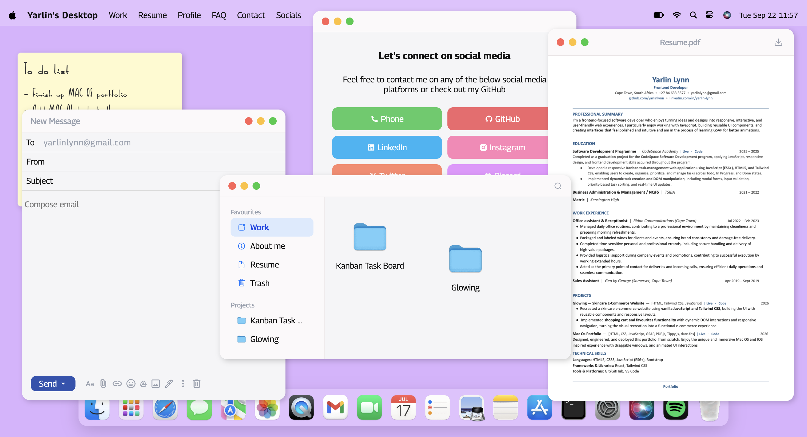
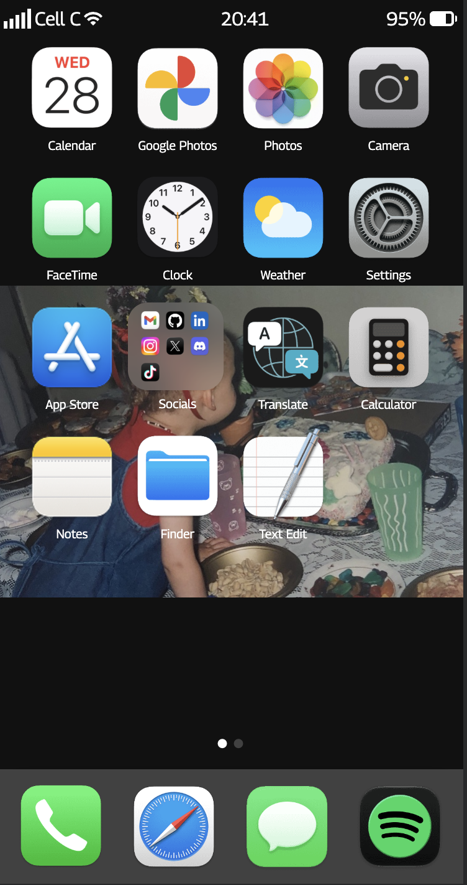

# 🖥️ Macfolio — macOS & iOS Inspired Portfolio

> An interactive portfolio experience designed to feel less like a website and more like an operating system.

**Macfolio** is a responsive personal portfolio inspired by the visual language and interaction patterns of macOS and iOS. Instead of presenting projects and information through a traditional scrolling portfolio, the site turns the portfolio itself into an interactive desktop environment.

Built from scratch with **HTML, CSS, JavaScript, and GSAP**, Macfolio features draggable application windows, a dynamic dock, Finder-style navigation, light and dark themes, and a dedicated mobile file-browsing experience.

<p float="left" align="center">
  
  &nbsp;&nbsp;&nbsp;&nbsp;
  
</p>

## ✨ Project Overview

Macfolio explores how a portfolio can become an experience rather than simply a collection of pages.

The interface is split into two intentionally different experiences:

* 🖥️ **Desktop** — a macOS-inspired interactive desktop with windows, applications, a dock, and Finder.
* 📱 **Mobile** — an iOS-inspired interface centered around a dedicated Files experience designed specifically for smaller screens.

The goal is not to simply make the desktop interface responsive, but to rethink how the portfolio should work on each device.


## 🖥️ Desktop Experience

The desktop experience recreates the feeling of using a lightweight macOS environment directly in the browser.

### Window System

Macfolio includes a custom window management system that allows applications to behave like desktop windows.

* Draggable windows
* Open and close interactions
* Window focus and layering
* Dynamic `z-index` management
* Reusable application window components
* Custom window controls
* Multiple applications open simultaneously
* Dynamic content rendered inside windows

A central `WindowManager` handles window registration, opening, closing, focusing, and passing data between applications.

### 🌓 Light & Dark Mode

The interface supports both **light and dark themes**, allowing the desktop environment and applications to adapt to the selected appearance.

The theme system extends across the interface to maintain a consistent visual experience rather than treating dark mode as a simple colour swap.


### 🚀 Animated Dock

The dock provides the primary way to launch applications from the desktop.

It includes an animated interaction inspired by the macOS dock, with smooth hover and transition effects powered by **GSAP**.

The dock acts as both navigation and part of the desktop experience, making launching an application feel like interacting with an operating system rather than navigating a traditional website.


## 📂 Finder — Desktop File System

One of the defining features of the desktop experience is the custom **Finder application**.

Rather than displaying portfolio projects as conventional cards, projects and personal information are organised into a virtual file system.


Files are represented as structured JavaScript data, allowing the Finder interface to dynamically render different types of portfolio content.

For example, the same system can represent:

```js
{
  name: "Project 1.txt",
  kind: "file",
  fileType: "txt",
  description: [
    "Project description..."
  ]
}
```

This allows portfolio content to behave like a collection of files rather than a series of static HTML sections.


## 📱 Mobile Experience

The mobile version intentionally introduces a dedicated mobile experience inspired by the way users interact with files on iOS.

### 📁 Files App

The mobile experience replaces the desktop Finder with a dedicated **Files application** designed around touch interaction and smaller displays.


This creates a clear distinction between the two experiences:

```text
Desktop
├── Desktop Environment
├── Dock
├── Applications
├── Finder
└── Floating Windows

Mobile
├── Files App
├── Breadcrumb Navigation
├── Folder View
└── File Preview
```

The result is two interfaces built around the strengths of their respective devices rather than one layout being forced to work everywhere.


## 🪟 Applications

Macfolio uses reusable window components to power different parts of the portfolio.

Current applications include:

* 📂 Finder
* 📁 Files
* 📝 Notes
* 📄 Resume Viewer
* 🖼️ Image Viewer
* 📃 Text Viewer
* ✉️ Gmail-inspired application

Each application can be opened within the window system and rendered dynamically based on the content being viewed.

## 🏗️ Architecture

At the centre of Macfolio is a custom JavaScript window management system.

```text
User interaction
       ↓
Application / Finder
       ↓
WindowManager
       ↓
Window state + content
       ↓
Application window
       ↓
Rendered portfolio content
```

The `WindowManager` is responsible for:

* Registering windows
* Opening applications
* Closing windows
* Focusing windows
* Managing window layering
* Passing content into applications

This architecture makes it possible to add new applications without rebuilding the desktop environment.

## 📁 Content System

Portfolio content is stored as structured JavaScript objects rather than being hardcoded into individual pages.

This allows the same underlying data to power both the desktop **Finder** and mobile **Files** experience.

Content can represent:

* Folders
* Projects
* Images
* Text documents
* PDFs
* External links
* Portfolio information

This separation between **content and presentation** makes it easier to expand the portfolio while keeping the interface consistent.

## 🛠️ Tech Stack

* **HTML5**
* **CSS3**
* **JavaScript ES6+**
* **Responsive Design**
* **DOM Manipulation**

### Libraries

* **GSAP** — animations, transitions and draggable interactions
* **GSAP Draggable** — interactive window dragging
* **PDF.js** — embedded PDF and resume rendering
* **date-fns** — date and time formatting
* **Tippy.js** — tooltips and UI enhancements


## 🎨 Design Philosophy

Macfolio is built around one central idea:

> **The portfolio itself should be something worth exploring.**

Rather than treating the interface as a container for portfolio content, the interface becomes part of the project.

The desktop environment provides the familiarity of a computer operating system, while the mobile experience adapts the same concept into a more natural touch-based file browser.

The distinction between **Finder on desktop** and **Files on mobile** is intentional: the goal is to create an experience that feels native to the device being used.

## 🚀 Running Locally

Clone the repository:

```bash
git clone https://github.com/yarlinlynn/macfolio.git
cd macfolio
```

Open the project in your browser using a local development server.

### 🎨 Tailwind CSS Migration

One planned improvement is migrating the current styling system from **plain CSS to Tailwind CSS**.

The goal is to install Tailwind through **npm** and gradually replace the existing custom CSS with Tailwind utility classes and reusable components.


The current version intentionally uses plain CSS, but moving towards Tailwind will provide a more scalable styling architecture as the portfolio continues to grow.


This migration is planned rather than currently implemented, so the existing project remains a plain CSS implementation.


## 📄 License

This project is open-source and free to use.

### ⭐ If you enjoyed the project

Feel free to explore the repository, experiment with the interface, or use the ideas as inspiration for your own portfolio.


